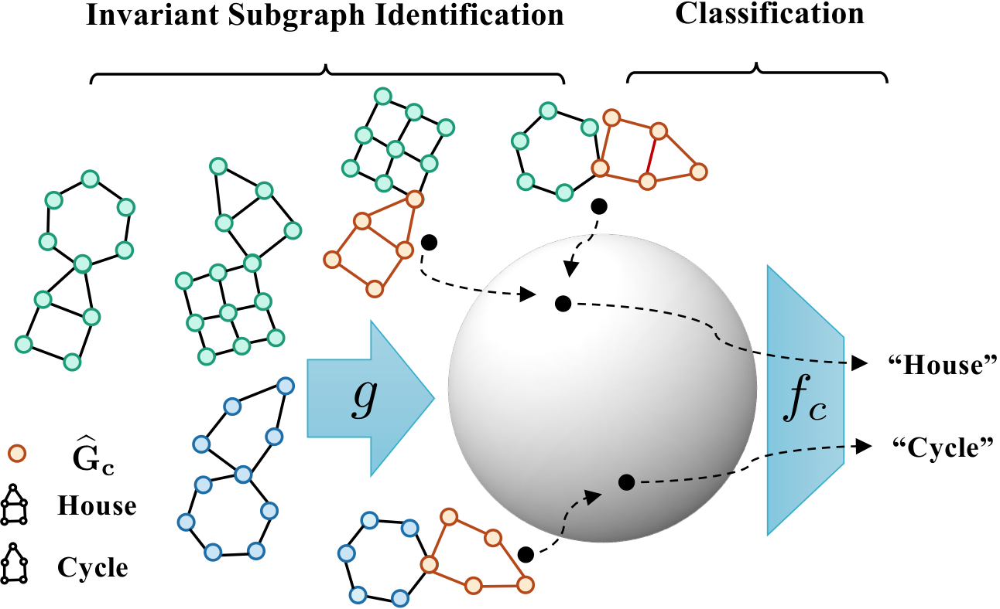

<h1 align="center">CIGA: Causality Inspired Invariant Graph LeArning</h1>
<p align="center">
    <a href="https://arxiv.org/abs/2202.05441"></a>
    <a href="https://github.com/LFhase/CIGA"></a>
    <!-- <a href="https://colab.research.google.com/drive/1t0_4BxEJ0XncyYvn_VyEQhxwNMvtSUNx?usp=sharing"></a> -->
    <a href="https://openreview.net/forum?id=A6AFK_JwrIW">  </a>
    <a href="https://github.com/LFhase/CIGA/blob/main/LICENSE">  </a>
    <a href="https://neurips.cc/virtual/2022/poster/54643"> </a>
    <a href="https://lfhase.win/files/slides/CIGA.pdf"> </a>
   <!--  <a href="https://icml.cc/media/PosterPDFs/ICML%202022/a8acc28734d4fe90ea24353d901ae678.png"> </a> -->
</p>


This repo contains the sample code for reproducing the results of our NeurIPS 2022 paper: *[Learning Causally Invariant Representations for Out-of-Distribution Generalization on Graphs](https://arxiv.org/abs/2202.05441)*, which was also presented at [ICML SCIS](https://sites.google.com/view/scis-workshop/home) Workshop, known as
*[Invariance Principle Meets Out-of-Distribution Generalization on Graphs](https://lfhase.win/files/papers/GOOD.pdf)*. 😆😆😆

TODO items:

- [x] Camera ready version of the paper is released on Oct. 12 ([link](https://arxiv.org/abs/2202.05441))!
- [x] Full code and instructions will be released soon!
- [ ] Benchmarking CIGA on [GOOD](https://github.com/divelab/GOOD) benchamrk, which is recently accepted by NeurIPS 2022 Datasets and Benchmarks Track!
    - A initial implementation is provided [here](https://github.com/LFhase/GOOD). Now working on benchmarking and making possible adjustments.
- [x] Released a [introductory blog](https://mp.weixin.qq.com/s/_CbZ-hOVTfmhBXlUd6kzgg) in Chinese. Check it out!
- [x] 2023 Jan. 4: Done the benchmarking for *14* datasets under `GOODMotif`, `GOODCMNIST`, `GOODSST2`, `GOODHIV` ([overview](https://github.com/LFhase/GOOD/blob/GOODv1/results/CIGA-GOOD-results_230104.pdf), [full results](https://docs.google.com/spreadsheets/d/1_v38zrC6d4pq6Xq4DL9z1eYQb6SCFmU4m-jAewXK_9I/edit?usp=sharing), [details](https://github.com/LFhase/GOOD))! CIGA is the SOTA Graph OOD algorithm under all benchmarked datasets! 🔥🔥🔥

## Introduction
Despite recent success in using the invariance principle for out-of-distribution (OOD) generalization on Euclidean data (e.g., images), studies on graph data are still limited. Different from images, the complex nature of graphs poses unique challenges to adopting the invariance principle:

1. Distribution shifts on graphs can appear in **<ins>a variety of forms</ins>**:
    - Node attributes;
    - Graph structure;
    - A mixure of both;

2. Each distribution shift can spuriously correlate with the label in **<ins>different modes</ins>**. We divide the modes into FIIF and PIIF, according to whether the latent causal feature $C$ fully determines the label $Y$, i.e., or $(S,E)\perp\mkern-9.5mu\perp Y|C$:
    - Fully Informative Invariant Features (FIIF): $Y\leftarrow C\rightarrow S\leftarrow E$;
    - Partially Informative Invariant Features (PIIF): $C\rightarrow Y\leftarrow S \leftarrow E$;
    - Mixed Informative Invariant Features (MIIF): mixed with both FIIF and PIIF;

3. **<ins>Domain or environment partitions</ins>**, which are often required by OOD methods on Euclidean data, can be highly expensive to obtain for graphs.


<p align="center"></p>
<p align="center"><em>Figure 1.</em> The architecture of CIGA.</p>

This work addresses the above challenges by generalizing the causal invariance principle to graphs, and instantiating it as CIGA. Shown as in Figure 1, CIGA is powered by an information-theoretic objective that extracts the subgraphs which maximally preserve the invariant intra-class information.
With certain assumptions, CIGA provably identifies the underlying invariant subgraphs (shown as the orange subgraphs).
Learning with these subgraphs is immune to distribution shifts. 

We implement CIGA using the interpretable GNN architecture, where the featurizer $g$ is designed to extract the invariant subgraph, and a classifier $f_c$ is designed to classify the extracted subgraph.
The objective is imposed as an additional contrastive penalty to enforce the invariance of the extracted subgraphs at a latent sphere space (CIGAv1).

1. When the size of underlying invariant subgraph $G_c$ is known and fixed across different graphs and environments, CIGAv1 is able to identify $G_c$. 
2. While it is often the case that the underlying $G_c$ varies, we further incorporate an additional penalty that maximizes $I(G_s;Y)$ to absorb potential spurious parts in the estimated $G_c$ (CIGAv2).

Extensive experiments on $16$ synthetic or real-world datasets, including a challenging setting -- DrugOOD, from AI-aided drug discovery, validate the superior OOD generalization ability of CIGA.

## Use CIGA in Your Code

CIGA is consist of two key regularization terms: one is the contrastive loss that maximizes $I(\widehat{G}_c;\widetilde{G}_c|Y)$;
the other is the hinge loss that maximizes $I(\widehat{G}_s;Y)$.

The contrastive loss is implemented via a simple call (line 480 in `main.py`):
```python
get_contrast_loss(causal_rep, label)
```
which requires two key inputs:
- `causal_rep`: the representations of the invariant subgraph representations;
- `label`: the labels corresponding to the original graphs.

The hinge loss is implemented in line 430 to line 445 in `main.py`:
```python
# a simple implementation of hinge loss
spu_loss_weight = torch.zeros(spu_pred_loss.size()).to(device)
spu_loss_weight[spu_pred_loss > pred_loss] = 1.0
spu_pred_loss = spu_pred_loss.dot(spu_loss_weight) / (sum(spu_pred_loss > pred_loss) + 1e-6)
```
which requires two key inputs:
- `spu_pred_loss`: sample-wise loss values of predictions based on the spurious subgraph $\widehat{G}_s$.
- `pred_loss`: sample-wise loss values of predictions based on the invariant subgraph $\widehat{G}_c$.

Then we can calculate the weights `spu_loss_weight` in the hinge loss for each sample based on the sample-wise loss values,
and apply the weights to `spu_pred_loss`.

## Instructions

### Installation and data preparation
Our code is based on the following libraries:

```
torch==1.9.0
torch-geometric==1.7.2
scikit-image==0.19.1 
```

plus the [DrugOOD](https://github.com/tencent-ailab/DrugOOD) benchmark repo.

The data used in the paper can be obtained following these [instructions](./dataset_gen/README.md).

### Reproduce results
We provide the hyperparamter tuning and evaluation details in the paper and appendix.
In the below we give a brief introduction of the commands and their usage in our code. 
We provide the corresponding running scripts in the [script](./scripts/) folder.

To obtain results of ERM, simply run 
```
python main.py --erm
```
with corresponding datasets and model specifications.


Runing with CIGA:
- `--ginv_opt` specifies the interpretable GNN architectures, which can be `asap` or `gib` to test with ASAP or GIB respectively.
- `--r` is also needed for interpretable GNN architectures that specify the interpretable ratio, i.e., the size of $G_c$.
- `--c_rep` controls the inputs of the contrastive learning, e.g., the graph representations from the featurizer or from the classifier
- `--c_in` controls the inputs to the classifier, e.g., the original graph features or the features from the featurizer
- To test with CIGAv1, simply specify `--ginv_opt` as default, and `--contrast` a value larger than `0`.
- While for CIGAv2, additionally specify `--spu_coe` to include the other objective.
- `--s_rep` controls the inputs for maximizing $I(\hat{G_s};Y)$, e.g., the graph representation of $\hat{G_s}$ from the classifier or the featurizer.

Running with the baselines:
- To test with DIR, simply specify `--ginv_opt` as default and `--dir` a value larger than `0`.
- To test with invariant learning baselines, specify `--num_envs=2` and
use `--irm_opt` to be `irm`, `vrex`, `eiil` or `ib-irm` to specify the methods,
and `--irm_p` to specify the penalty weights.

Due to the additional dependence of an ERM reference model in CNC, we need to train an ERM model and save it first,
and then load the model to generate ERM predictions for positive/negative pairs sampling in CNC. 
Here is a simplistic example:
```
python main.py --erm --contrast 0 --save_model
python main.py --erm --contrast 1  -c_sam 'cnc'
```

## Misc
As discussed in the paper that the current code is merely a prototypical implementation based on an interpretable GNN architecture, i.e., [GAE](https://arxiv.org/abs/1611.07308), in fact there could be more implementation choices:
- For the architectures: CIGA can also be implemented via [GIB](https://github.com/Samyu0304/Improving-Subgraph-Recognition-with-Variation-Graph-Information-Bottleneck-VGIB-) and [GSAT](https://github.com/Graph-COM/GSAT). 
- For the hyperparameter tunning: You may find plentiful literature from [multi-task learning](https://github.com/median-research-group/LibMTL), or try out [PAIR](https://arxiv.org/abs/2206.07766).
- Besides, CIGA is also compatible with state-of-the-art contrastive augmentations for graph learning, which you may find useful information from [PyGCL](https://github.com/PyGCL/PyGCL).

You can also find more discussions on the limitations and future works in Appendix B of our paper.

That being said, CIGA is definitely not the ultimate solution and it intrinsically has many limitations. 
Nevertheless, we hope the causal analysis and the inspired solution in CIGA could serve as an initial step towards more reliable graph learning algorithms that are able to generalize various OOD graphs from the real world.


If you find our paper and repo useful, please cite our paper:

```bibtex
@InProceedings{chen2022ciga,
  title       = {Learning Causally Invariant Representations for Out-of-Distribution Generalization on Graphs},
  author      = {Yongqiang Chen and Yonggang Zhang and Yatao Bian and Han Yang and Kaili Ma and Binghui Xie and Tongliang Liu and Bo Han and James Cheng},
  booktitle   = {Advances in Neural Information Processing Systems},
  year        = {2022}
}
```

Ack: The readme is inspired by [GSAT](https://github.com/Graph-COM/GSAT). 😄
